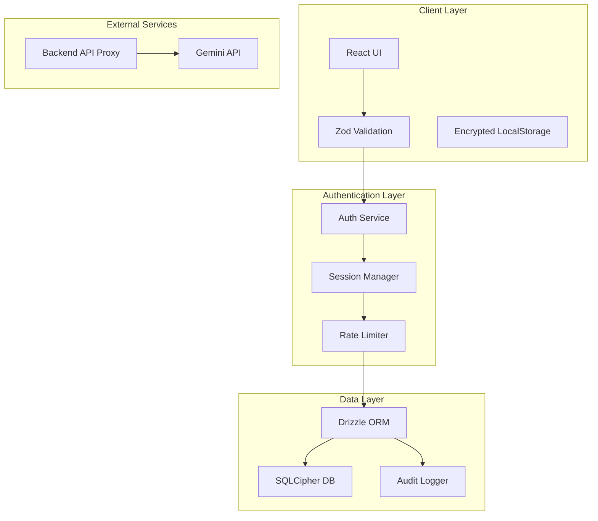

# Security Audit Report: Hyphae Suit

> **Audit Date**: 2026-02-16  
> **Auditor**: Security Review  
> **Status**: Early Formation Review  - Z.ai: GLM 5 (Kilo Code)

## Executive Summary

This security audit was conducted on the Hyphae Suit monorepo, which is in early development stages. The codebase shows good security awareness with documented policies, but several critical implementation gaps exist that should be addressed before production deployment.

### Risk Overview

| Severity | Count | Category |
|----------|-------|----------|
| 🔴 Critical | 2 | Authentication, Secrets Management |
| 🟠 High | 3 | Input Validation, Session Management |
| 🟡 Medium | 4 | Data Storage, Database Security |
| 🟢 Low | 2 | Configuration, Documentation |

---

## Critical Findings

### 1. Hardcoded Credentials in Source Code 🔴

**Severity**: Critical  
**Location**: [`apps/pos/src/data/mock_data.ts:29-33`](apps/pos/src/data/mock_data.ts:29)

```typescript
export const STAFF_PROFILES: StaffProfile[] = [
  { id: 'staff_mgr', name: 'Sarah Manager', pin: '1234', role: 'Manager' },
  { id: 'staff_001', name: 'John Cashier', pin: '1111', role: 'Cashier' },
  { id: 'staff_002', name: 'Mike Line', pin: '2222', role: 'Kitchen' },
];
```

**Risk**: Hardcoded PINs in source code can be exploited if code is exposed. Even in early development, this establishes dangerous patterns.

**Recommendations**:
1. Remove all hardcoded credentials from source code immediately
2. Use environment variables or secure credential storage
3. Implement proper password hashing (bcrypt/Argon2) before storing
4. Create a secure seed script that generates random initial credentials

---

### 2. API Key Exposure in Client-Side Bundle 🔴

**Severity**: Critical  
**Location**: [`apps/pos/vite.config.ts:13-16`](apps/pos/vite.config.ts:13), [`apps/core/vite.config.ts:13-16`](apps/core/vite.config.ts:13)

```typescript
define: {
  'process.env.API_KEY': JSON.stringify(env.GEMINI_API_KEY),
  'process.env.GEMINI_API_KEY': JSON.stringify(env.GEMINI_API_KEY)
},
```

**Risk**: This configuration bundles the Gemini API key into the client-side JavaScript bundle. Anyone with access to the deployed application can extract this key from the browser dev tools.

**Recommendations**:
1. **Never** bundle API keys in client-side code
2. Create a backend proxy service for Gemini API calls
3. Use server-side environment variables only
4. Consider using a secrets management service for production

---

## High Severity Findings

### 3. Missing Input Validation Implementation 🟠

**Severity**: High  
**Location**: Throughout codebase

**Finding**: While the [`SECURITY.md`](apps/pos/SECURITY.md:23-45) mandates Zod schema validation, no actual Zod schemas are implemented in the codebase. All validation exists only in documentation.

**Current State**:
- No runtime validation on form inputs
- No API payload validation
- Type-only checks via TypeScript (no runtime protection)

**Recommendations**:
1. Implement Zod schemas for all user inputs as documented
2. Create validation schemas in `packages/schemas/src/`:
   - `order.schema.ts`
   - `auth.schema.ts`
   - `inventory.schema.ts`
3. Apply validation at all entry points (forms, API handlers)

---

### 4. No Session Management or Timeout 🟠

**Severity**: High  
**Location**: [`apps/pos/src/context/OrderContext.tsx`](apps/pos/src/context/OrderContext.tsx)

**Finding**: The application stores state in localStorage without session expiration or auto-logout functionality. The documented 15-minute timeout is not implemented.

**Current State**:
```typescript
const LOCAL_STORAGE_KEY = 'hyphae_pos_state_v3';
// No expiration, no session validation
```

**Recommendations**:
1. Implement session timeout with configurable duration
2. Add activity tracking to reset timeout
3. Clear sensitive data on session expiration
4. Implement secure session token rotation

---

### 5. Missing Authentication Service 🟠

**Severity**: High  
**Location**: [`packages/schemas/src/types.ts:123-128`](packages/schemas/src/types.ts:123)

**Finding**: The `StaffProfile` interface contains a plaintext `pin` field with a comment indicating awareness but no implementation:

```typescript
export interface StaffProfile {
    id: string;
    name: string;
    pin: string; // In real app, hashed
    role: StaffRole;
}
```

**Recommendations**:
1. Create an `AuthService` module with:
   - Secure PIN hashing (bcrypt with cost factor 12+)
   - Login attempt limiting (max 3 attempts)
   - Account lockout mechanism
   - Session token generation
2. Remove PIN from `StaffProfile` interface
3. Store only hashed credentials in database

---

## Medium Severity Findings

### 6. Unencrypted Local Storage 🟡

**Severity**: Medium  
**Location**: [`apps/pos/src/context/OrderContext.tsx:422-432`](apps/pos/src/context/OrderContext.tsx:422), [`apps/pos/src/lib/indexedDB.ts`](apps/pos/src/lib/indexedDB.ts)

**Finding**: Sensitive data stored without encryption:
- Order history with customer information
- Loyalty profiles with personal data
- Transaction records

**Recommendations**:
1. Implement encryption for sensitive localStorage data
2. Use Electron's `safeStorage` API for desktop app
3. Consider using Web Crypto API for browser storage encryption
4. Classify data by sensitivity and apply appropriate protection

---

### 7. Database Security Gaps 🟡

**Severity**: Medium  
**Location**: [`packages/database/src/index.ts`](packages/database/src/index.ts)

**Findings**:
- SQLite database path is hardcoded
- No encryption at rest
- Auth token handling exists but no validation

**Good Practices Found**:
- Using Drizzle ORM with parameterized queries (SQL injection protected)
- Database files excluded from git
- Auth token support for remote databases

**Recommendations**:
1. Add SQLCipher encryption for SQLite at rest
2. Validate auth tokens before database operations
3. Implement database backup encryption
4. Add database access logging for audit trails

---

### 8. Missing Security Headers 🟡

**Severity**: Medium  
**Location**: Build configuration

**Finding**: No Content-Security-Policy (CSP) or other security headers configured. This is expected for a Vite SPA but should be addressed for production.

**Recommendations**:
1. Add CSP headers in production server configuration
2. Implement X-Frame-Options: DENY
3. Add X-Content-Type-Options: nosniff
4. Consider using helmet.js if a Node server is added

---

### 9. Mock Data Contains Realistic Secrets 🟡

**Severity**: Medium  
**Location**: [`packages/database/src/mock_data.ts:695-716`](packages/database/src/mock_data.ts:695)

**Finding**: Mock data contains realistic-looking API keys and tokens:

```typescript
liveApiKey: "sk_live_***********",
partnerToken: "uber_tok_*******",
partnerToken: "dash_tok_*******",
```

**Risk**: While masked, this pattern could lead to accidental commit of real credentials.

**Recommendations**:
1. Use obviously fake values: `sk_test_NOT_REAL`
2. Add pre-commit hooks to scan for potential secrets
3. Document that mock data should never contain real credentials

---

## Low Severity Findings

### 10. Environment Configuration Inconsistencies 🟢

**Severity**: Low  
**Location**: [`apps/pos/.env.example`](apps/pos/.env.example)

**Finding**: Inconsistent variable naming:
- `VITE_API_URL` vs `VITE_API_BASE_URL`
- Some variables documented but not implemented

**Recommendations**:
1. Standardize environment variable naming
2. Ensure `.env.example` matches actual required variables
3. Add validation for required environment variables at startup

---

### 11. Missing Audit Logging 🟢

**Severity**: Low (documented but not implemented)  
**Location**: [`apps/pos/SECURITY.md:91-108`](apps/pos/SECURITY.md:91)

**Finding**: Security policy requires audit logging for sensitive operations, but no implementation exists.

**Recommendations**:
1. Implement audit log table in database schema
2. Log all security-sensitive events:
   - Authentication attempts (success/failure)
   - Order voids/refunds
   - Staff permission changes
   - Cash drawer operations
3. Create audit log viewer for managers

---

## Positive Security Practices

The codebase demonstrates good security awareness:

1. **SQL Injection Protection**: Using Drizzle ORM with parameterized queries throughout
2. **XSS Prevention**: No `dangerouslySetInnerHTML`, `eval()`, or `innerHTML` usage found
3. **Secrets Exclusion**: `.env` files properly excluded from git
4. **Security Documentation**: Comprehensive `SECURITY.md` with clear guidelines
5. **Type Safety**: Strong TypeScript usage throughout
6. **Dependency Management**: Using `pnpm audit` as documented

---

## Prioritized Remediation Plan

### Phase 1: Immediate (Before Any Production Deployment)

1. ✅ Remove hardcoded PINs from [`mock_data.ts`](apps/pos/src/data/mock_data.ts)
2. ✅ Fix API key exposure in Vite configuration
3. ✅ Implement basic Zod validation for critical inputs

### Phase 2: Short-term (Next Sprint)

1. Implement `AuthService` with secure PIN hashing
2. Add session timeout and management
3. Implement audit logging for sensitive operations
4. Add CSP headers to production build

### Phase 3: Medium-term (Pre-Production)

1. Implement encrypted storage for sensitive data
2. Add SQLCipher for database encryption
3. Complete input validation coverage
4. Security penetration testing

---

## Architecture Recommendations



---

## Conclusion

The Hyphae Suit project shows promising security awareness through its documentation and some architectural decisions. However, critical gaps exist between documented policies and actual implementation. The most urgent issues are:

1. **Hardcoded credentials** that establish dangerous patterns
2. **API key exposure** that could lead to credential theft

These should be addressed immediately before any production consideration. The medium and low-severity findings can be addressed as part of the normal development roadmap.

---

## References

- [OWASP Top 10](https://owasp.org/www-project-top-ten/)
- [OWASP Cheat Sheet Series](https://cheatsheetseries.owasp.org/)
- [Electron Security Guidelines](https://www.electronjs.org/docs/latest/tutorial/security)
- [Google Gemini API Security Best Practices](https://ai.google.dev/gemini-api/docs/api-key)
